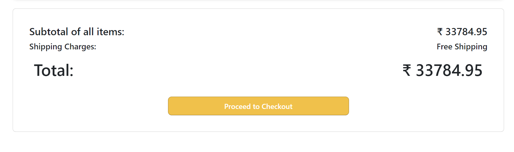

> # React-Context-API

This repository is for the development for React Based App to show case the functionality of React Redux which is used to update the price amount in total when items are added or decreased.

---

## Product Card

Here, you can see the list of similar items which you have added to the cart.This contains the product image, title , description and price. The default quantity is kept as 1 and the subtotal will be shown and the right bottom of the card as per the quantity.

---

### Change in Quantity

When the quantity is increased or decreased, the subtotal also changes.

---

### Save For Later

When clicked on "Save for Later", the item added to save for later alert is shown.

---

When the subtotal is less than INR 500, then shipping charges of INR 100 is added as shown below.

If not, then free for shipping

---

### Delete

When clicked on "Delete", the quantity and respective subtotal is set to zero.

---

### Proceed to Checkout

When clicked on "Proceed to Checkout", an alert of Redirecting to Bank's site is shown.

---
